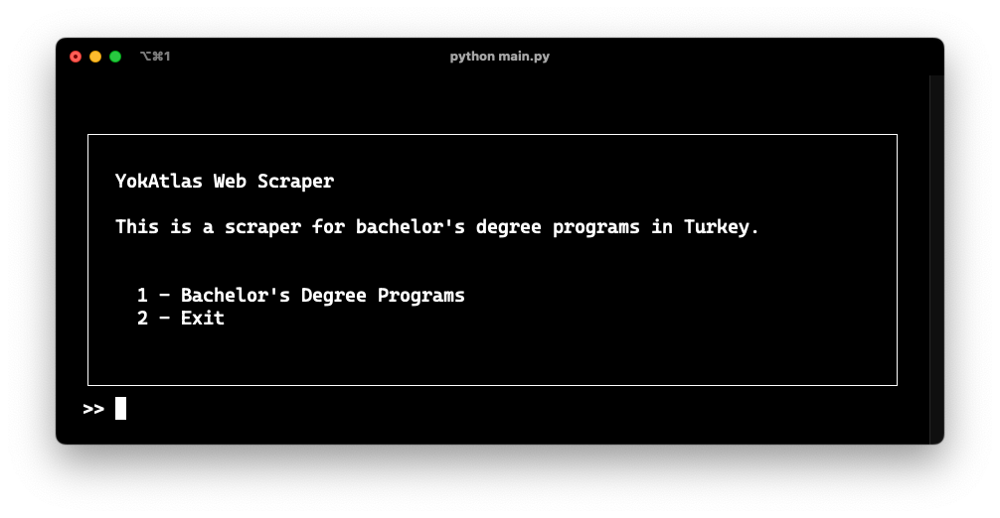
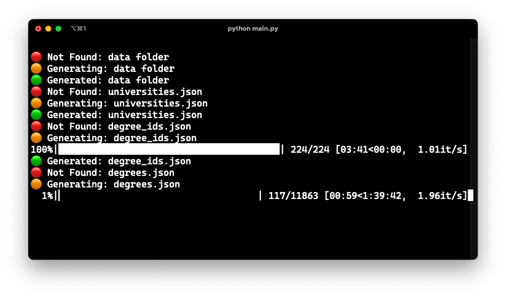

# YokAtlas Web Scraper

This project is a web scraper designed to extract bachelor's degree program details from universities in Turkey. It is built using Python with BeautifulSoup and Selenium to efficiently parse and collect the required information.

# Screens

    
    

